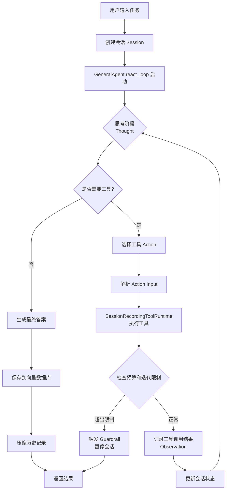
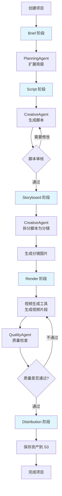
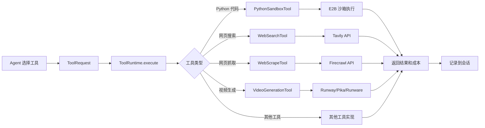

# Lewis AI System

一个双模式 AI 编排平台，提供创意内容生成和通用任务自动化的结构化工作流。

## Agent 执行逻辑

系统采用两种不同的 Agent 执行模式，分别针对不同类型的任务进行优化。

### 通用模式 (General Mode) - ReAct 循环

通用模式使用 **ReAct (Reasoning + Acting)** 循环来执行任务。Agent 通过思考-行动-观察的循环逐步解决问题。



#### ReAct 循环详细流程

1. **初始化阶段**
   - 接收用户任务目标
   - 创建 `GeneralSession` 会话对象
   - 初始化预算限制和最大迭代次数

2. **循环执行阶段** (最多执行 `max_steps` 次)
   ```
   Question: 用户任务
   Thought: Agent 分析当前情况
   Action: 选择要使用的工具名称
   Action Input: 工具参数 (JSON 格式)
   Observation: 工具执行结果
   [重复上述步骤直到找到答案]
   Final Answer: 最终答案
   ```

3. **工具执行包装**
   - `SessionRecordingToolRuntime` 包装原始工具运行时
   - 每次工具调用前检查：
     - 会话状态是否为 ACTIVE
     - 是否超过最大迭代次数
     - 是否超过预算限制
   - 记录每次工具调用的：
     - 工具名称和参数
     - 执行结果
     - 成本消耗
     - 决策路径

4. **内存管理**
   - 每次迭代后，将最近 `memory_window` 条消息存储到向量数据库
   - 当消息数量超过 `compression_threshold` 时，压缩历史记录
   - 使用 `OutputFormatterAgent` 生成历史摘要

5. **Guardrail 机制**
   - 预算超限：自动暂停会话
   - 迭代超限：达到最大迭代次数时停止
   - 状态检查：非 ACTIVE 状态无法继续执行

### 创作模式 (Creative Mode) - 分阶段工作流

创作模式采用 **分阶段管道 (Staged Pipeline)** 架构，将视频创作流程分解为多个有序阶段。



#### 创作模式详细流程

1. **Brief 阶段 (BRIEF_PENDING)**
   - `PlanningAgent.expand_brief()` 扩展用户输入的简报
   - 生成更详细的项目描述和需求

2. **Script 阶段 (SCRIPT_PENDING)**
   - `CreativeAgent.write_script()` 生成分场景脚本
   - 脚本包含场景标题、动作描述、对话等
   - 完成后进入 `SCRIPT_REVIEW` 状态等待审核

3. **Storyboard 阶段 (STORYBOARD_PENDING)**
   - `CreativeAgent.split_script()` 将脚本拆分为分镜
   - 每个分镜包含：
     - 视觉描述
     - 视觉提示（镜头、灯光等）
     - 预估时长
   - `CreativeAgent.generate_panel_visual()` 为每个分镜生成预览图
   - 完成后进入 `STORYBOARD_READY` 状态

4. **Render 阶段 (RENDERING)**
   - 遍历所有分镜，调用视频生成工具
   - 支持多个视频提供商：
     - Runway API
     - Pika API
     - Runware API
   - 每个视频片段生成后保存到 S3 存储

5. **Quality Control 阶段**
   - `QualityAgent.run_qc_workflow()` 执行质量检查
   - 应用多个 QC 规则：
     - 内容质量 (content_quality)
     - 完整性 (completeness)
     - 技术质量 (technical_quality)
   - 每个规则有独立的阈值和评估标准
   - 如果质量不达标，可以重新生成

6. **Distribution 阶段**
   - 将所有生成的资产保存到 S3
   - 创建分发记录
   - 生成预览链接
   - 项目状态变为 `COMPLETED`

### Agent 类型说明

系统包含以下专用 Agent：

#### PlanningAgent
- **职责**: 扩展和优化用户输入的简报
- **方法**: `expand_brief(prompt, mode)`
- **用途**: 将简短的需求扩展为详细的项目描述

#### CreativeAgent
- **职责**: 处理创意内容生成
- **主要方法**:
  - `write_script()`: 生成视频脚本
  - `split_script()`: 将脚本拆分为分镜
  - `generate_panel_visual()`: 生成分镜预览图

#### QualityAgent
- **职责**: 执行质量评估和检查
- **主要方法**:
  - `evaluate()`: 评估内容质量
  - `run_qc_workflow()`: 运行完整的质量检查工作流
  - `validate_preview()`: 验证预览内容
- **特性**: 支持自定义 QC 规则引擎

#### GeneralAgent
- **职责**: 执行通用任务的 ReAct 循环
- **主要方法**: `react_loop(query, tool_runtime, max_steps)`
- **工作方式**: 通过思考-行动-观察循环逐步解决问题

#### OutputFormatterAgent
- **职责**: 格式化输出内容
- **主要方法**: `summarize()`: 生成内容摘要

### 工具执行机制



#### 工具执行流程

1. **工具注册**
   - 所有工具在 `ToolRuntime` 中注册
   - 每个工具实现 `Tool` 接口
   - 工具必须提供：
     - `name`: 工具名称
     - `description`: 工具描述
     - `parameters`: JSON Schema 参数定义
     - `run()`: 执行方法

2. **工具调用**
   - Agent 解析 LLM 响应，提取工具名称和参数
   - 创建 `ToolRequest` 对象
   - `ToolRuntime.execute()` 执行工具
   - 返回 `ToolResult`，包含输出和成本

3. **成本跟踪**
   - 每次工具调用记录成本
   - 成本累加到会话的 `spent_usd`
   - 实时检查预算限制

4. **错误处理**
   - 工具执行失败时返回错误信息
   - Agent 可以根据错误信息调整策略
   - 超过重试次数后终止循环

### 系统架构

```
FastAPI 应用层
├── 路由层
│   ├── /creative/* - 创作模式 API
│   ├── /general/* - 通用模式 API
│   └── /governance/* - 治理和监控 API
├── 编排层
│   ├── CreativeOrchestrator - 创作工作流编排
│   └── GeneralModeOrchestrator - ReAct 循环编排
├── Agent 层
│   ├── PlanningAgent
│   ├── CreativeAgent
│   ├── QualityAgent
│   ├── GeneralAgent
│   └── OutputFormatterAgent
├── 工具层
│   ├── ToolRuntime - 工具注册和执行
│   ├── PythonSandboxTool - 代码执行
│   ├── WebSearchTool - 网页搜索
│   ├── VideoGenerationTool - 视频生成
│   └── 其他工具...
└── 基础设施层
    ├── PostgreSQL - 数据持久化
    ├── Redis - 缓存和限流
    ├── Weaviate - 向量存储
    └── S3 - 对象存储
```

## 技术栈

### 后端

- **运行时**: Python 3.11+
- **框架**: FastAPI (支持 async/await)
- **ORM**: SQLAlchemy 2.0 (使用 asyncpg 驱动)
- **迁移**: Alembic (数据库版本管理)
- **缓存**: Redis (分布式缓存和限流)
- **向量数据库**: Weaviate (语义搜索和长期记忆)
- **存储**: boto3 (S3 兼容对象存储)
- **任务队列**: ARQ (后台任务处理)
- **沙箱**: E2B Code Interpreter (安全代码执行)

### 前端

- **框架**: Next.js 14 (App Router)
- **语言**: TypeScript
- **UI 库**: React 18
- **样式**: Tailwind CSS
- **组件**: Radix UI
- **状态管理**: Zustand
- **数据获取**: TanStack Query
- **动画**: Framer Motion

### 基础设施

- **容器化**: Docker (多阶段构建)
- **编排**: Docker Compose
- **数据库**: PostgreSQL 15+
- **缓存**: Redis 7+
- **向量存储**: Weaviate (可选)

## 快速开始

### 先决条件

- Python 3.11 或更高版本
- Node.js 18+ (前端开发)
- Docker 和 Docker Compose (容器化部署)
- PostgreSQL, Redis, Weaviate (或使用 Docker Compose 服务)

### 安装

1. 克隆仓库
2. 复制 `.env.example` 为 `.env` 并配置 API 密钥
3. 安装后端依赖: `pip install -e .`
4. 安装前端依赖: `cd frontend && npm install`
5. 初始化数据库: `python -m lewis_ai_system.cli init-db`
6. 启动服务: `docker compose up -d` 或使用启动脚本

### 配置

主要环境变量:
- `DATABASE_URL` - PostgreSQL 连接字符串
- `REDIS_URL` - Redis 连接字符串
- `VECTOR_DB_URL` - Weaviate 端点 (可选)
- `S3_*` - 对象存储凭据
- 提供商 API 密钥 (OpenRouter, Runway, Pika 等)

完整配置选项请参考 `.env.example`。

## 项目结构

```
lewis_ai_system/
├── src/lewis_ai_system/
│   ├── routers/          # API 路由处理
│   ├── creative/         # 创作模式工作流
│   │   ├── workflow.py   # CreativeOrchestrator
│   │   ├── models.py     # 数据模型
│   │   └── repository.py # 数据访问层
│   ├── general/          # 通用模式会话
│   │   ├── session.py    # GeneralModeOrchestrator
│   │   ├── models.py     # 数据模型
│   │   └── repository.py # 数据访问层
│   ├── governance/       # 成本和使用跟踪
│   ├── agents.py         # Agent 实现
│   ├── tooling.py        # 工具注册和执行
│   ├── providers.py      # LLM 提供商抽象
│   ├── database.py       # 数据库模型
│   ├── redis_cache.py    # Redis 缓存
│   ├── vector_db.py      # 向量数据库
│   └── main.py           # FastAPI 应用入口
├── frontend/             # Next.js 前端应用
├── tests/                # 测试套件
└── alembic/              # 数据库迁移
```

## 许可证

MIT License
